# 💫 nvtam_X 💫

  

<!-- Usagi Terminal: Big Code -> Clear -> Mascot Art -->

---

### 🛠️ Tech Stack & Tools

<!-- Modern Skill Icons Bar -->

  

<!-- Categorized Badges -->

  <b>💻 Languages & Core</b> 
  
  
  
  
  
  
  

  <b>🚀 Frameworks & Runtimes</b> 
  
  
  

  <b>🛠️ IDEs & Development Tools</b> 
  
  
  
  
  
  
  

  <b>🤖 AI & Intelligent Tools</b> 
  
  
  

---

